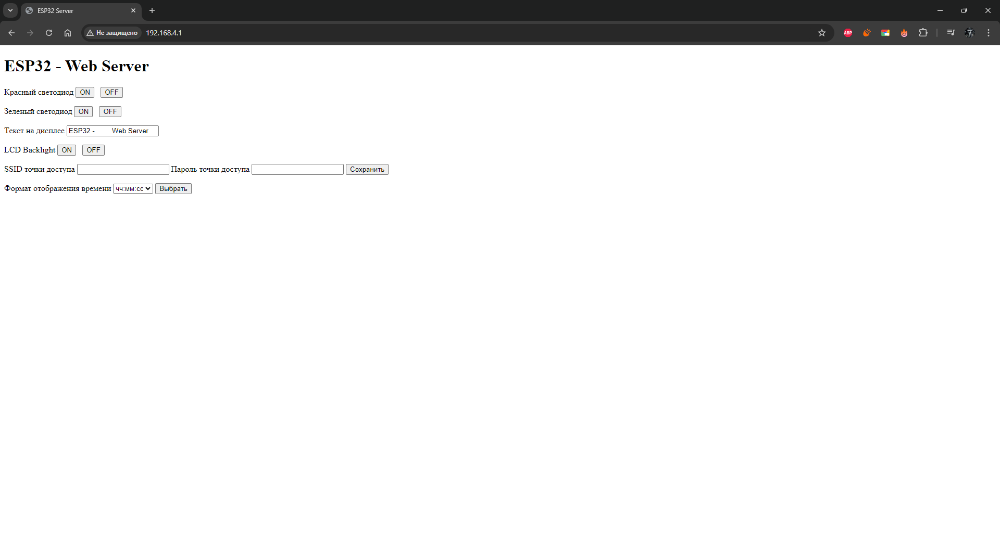
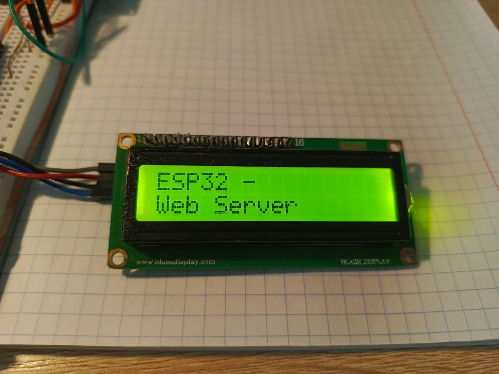
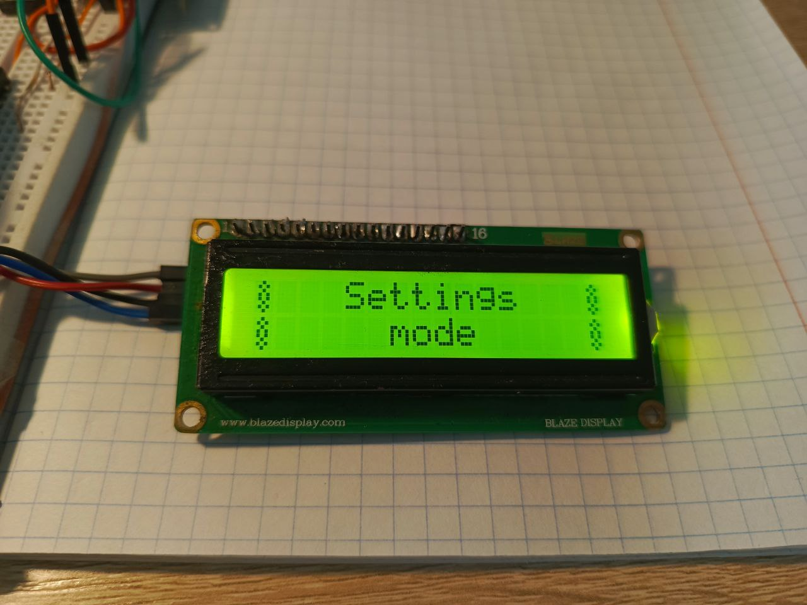
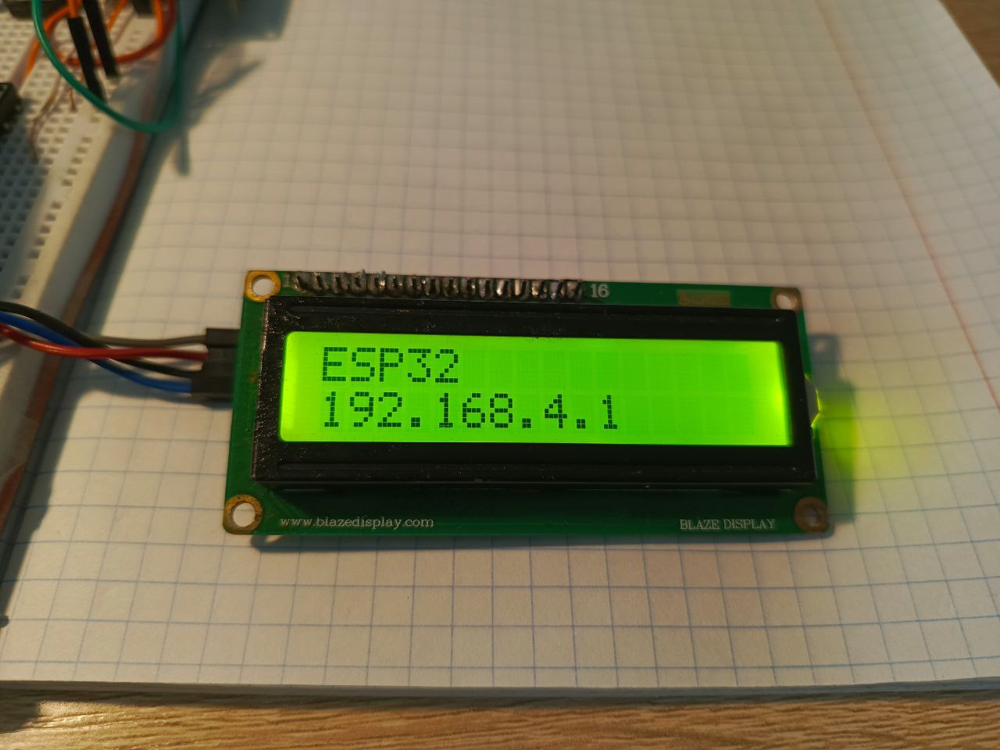
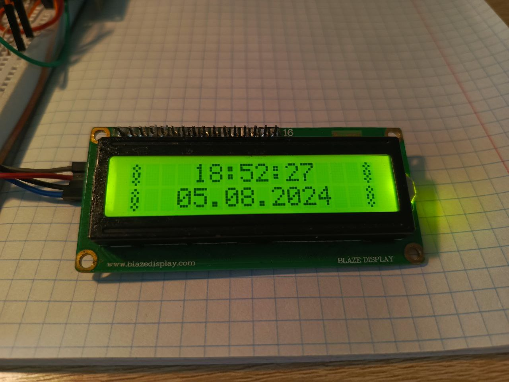

# Сервер на ESP32

Данный проект реализует возможность подключения к ESP32 с помощью "мягкой" точки доступа, создаваемой изделием, и браузера на компьютере или телефоне.
С помощью страницы настройки можно ввести SSID и пароль точки доступа Wi-Fi для того, чтобы ESP32 смогла выйти в интернет.

На данный момент единственной функцией выхода в интернет является запрос текущего времени с помощью API сервера точного времени.

  

В перспективе данный проект может быть расширен до системы умного дома.

<table>
  <tr>
    <td>
      
    </td>
    <td>
      
    </td>
  </tr>
  <tr>
    <td>
      
    </td>
    <td>
      
    </td>
  </tr>
  <tr>
    <td align="center" colspan="2">
      
    </td>
  </tr>
</table>
